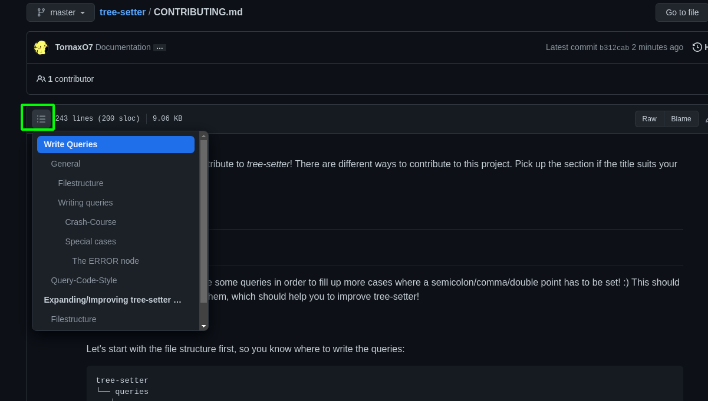
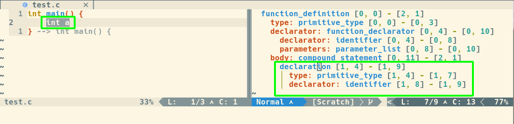
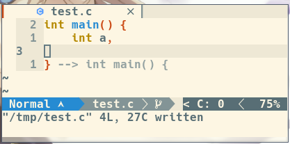

Thank you for wanting to contribute to *tree-setter*!
There are different ways to contribute to this project. Pick up the section from
the table of contents if the title suits your intention. Here's a little image
of how to open the table of contents:



# Write Queries
## General
Thank you for wanting to write some queries in order to fill up more cases where
a semicolon/comma/double point has to be set! :)
This should be a little guide on how to write them, which should help you to
improve `tree-setter`!

### File Structure
Let's start with the file structure first, so you know where to write the
queries:

```
tree-setter
└── queries
   ├── c
   │   └── tsetter.scm
   ├── cpp
   │   └── tsetter.scm
   └── lua
       └── tsetter.scm
```

The interesting directory is `tree-setter/queries` which includes all queries
for their appropriate language. Each directory (for the language) has a
`tsetter.scm` file. They *have* to be named as that since `tree-setter` assumes
that the files are named like that! To sum it up:

1. Look if a directory with the language name exists or not
    - If yes => Navigate to it
    - Otherwise => Create it
2. Look if there's already a `tsetter.scm` file
    - If yes => Open it in ~~your favourite editor~~ neovim!
    - Otherwise => Create it!

### Writing queries
#### Crash-Course
So now we're getting into the interesting part!
I'm using C as the example language here since it's pretty mature. If you want
to see more details about the queries (of C), open
`tree-setter/queries/c/tsetter.scm` in ~~your text-editor~~ neovim (hint, it's
probably worth it since they include some comments which should make it
understandable) ;).

Let's take a look at the following query code:

```scheme
(declaration
    type: (_)
    declarator: (_) @semicolon
)
```

We can see a code-tree-structure like code. If you take a look into the tsetter
file of the C language, you'll see that I picked the first query of it.
But how did I find out that the query has to look like this to let TreeSitter know that this is a declaration? Well, I'm using
[nvim-treesitter/playground](https://github.com/nvim-treesitter/playground) for
that. Let's create a new C-file and open up the playground! It'll look like
this:



As you can see, there's a similar structure on the playground:

```scheme
declaration [1, 4] - [1, 10]
    type: primitive_type [1, 4] - [1, 7]
    declarator: identifier [1, 8] - [1, 9]
```

very nice! So all we need to do is just write this query down as it's
displayed in the playground.

**Note:** Make sure that you removed the semicolon because sometimes TreeSitter parses
the query *differently* if there's a semicolon or not!

`(_)` are used, because according to the
[docs](https://tree-sitter.github.io/tree-sitter/using-parsers#named-vs-anonymous-nodes)
we can create anonymous nodes. But why? Well, `type` needn't be always a
`primitve_type` (here an `int`). It could also be a char or something else, we
don't know. So we are using an anonymous node!

Ok, but how does the module know if it should add a semicolon, comma or a double
point? Well, we are doing this by adding this `@`-thing which is called a
"predicate". Just write after the `@` which character has to be added. If there
should be a comma instead of a semicolon, then write `@comma` instead. There are
four different predicates for this module which you can use:

- `@semicolon`
- `@comma`
- `@double_points`
- `@skip`
- `@equals`

Each predicate refers to their appropriate character as the name says. So if
there should be a comma after a declaration instead, then you can write it as
follows:

```scheme
(declaration
    type: (_)
    declarator: (_) @comma
)
```

This will place a comma after a declaration instead of a semicolon:



One "exception" is the `@skip` predicate. As the name says, you say TreeSitter, and it should _not_* check in the current query if a query matches. This happens
for example in the following case (also described in the last lines of the
`tsetter.scm` file in C):

```c
if (test()
```

without the last query from the C queries, `tree-setter` would add a semicolon
after `test()` if you would hit the enter key now! This is not what we want! So
`tree-setter` should skip this part, that's the usage of this `@skip`.

By the way: It *is* important *where* you but the predicate, because
`tree-setter` will put the semicolon, etc. on the place of the predicate!

Now you should be able to write some queries for your language now! :)
Please follow the
[query-code-styles](./CONTRIBUTING.md#query-code-style) (below)
to make it better to maintain and better to understand before creating a pull
request ;)

### Tips
#### General
If you want to know more on how to write queries, then you can read it from the
[official
docs](https://tree-sitter.github.io/tree-sitter/using-parsers#query-syntax).
This should explain you some more features and tricks on how to write them :)

I also recommend to read through `:h lua-treesitter-query` which explains it
partially as well.


#### "Weird" queries
Some queries might be pretty problematic... Look at this query for example (also
from the query file of C):

```scheme
((ERROR
    (call_expression
        function: (identifier)
        arguments: (argument_list)
    )
) @semicolon)
```

This query is used to indicate a user-function which is called. Yes it might
look weird, but that's how TreeSitter evaluates the code if the semicolon is
missing, so keep an eye on the playground what it's displaying!

## Query-Code-Style
Please write the queries in the following style:

```scheme
<Look first, if there is a suitable sub-section where you could add your Query>
;; <Short description of its usage>
;; Example(s):
;;      <a short example which should be triggered>
;;
;; <If needed: A little description if there are "corner cases" or other stuff
;; which has to be considered>
<The query>
```

Here's an example of a C query of `tree-setter/queries/c/tsetter.scm`:

```scheme
;; ===================
;; Action Queries
;; ===================
;; --------------
;; Variables
;; --------------
;; For known declarations and initialisations
;; Example:
;;      char var_name
;;      int var_name = 10

;; Somehow `long` can't be seen as a declaration first, only if the semicolon is
;; added, so we have to use the query below for these cases.
(declaration
    type: (_)
    declarator: (_) @semicolon
)
```

# Expanding/Improving tree-setter code
So this is gonna be about the backend of `tree-setter`. You'll get a rough
overview of how the code works in order to be able to extend the code! So let's
start with the file structure first!

## File structure
Here is the File structure with the most important files and a little description
for them on the right:

```
tree-setter
├── CONTRIBUTING.md         The document you're reading
├── Documentation_Images    All images which are used in the documentation
├── lua                     The "heart" directory of this module
│   ├── tree-setter         
│   │   ├── main.lua        This file includes the main functions of the
│   │   │                       module like checking if any queries match for
│   │   │                       the current file or not and looking if the user
│   │   │                       hit enter.
│   │   └── setter.lua      This file holds only one function, which will add
│   │                           the appropriate character to the given line.
│   └── tree-setter.lua     Includes the entry point for a treesitter module
│                              (here: tree-setter)
├── plugin
│   └── tree-setter.vim     Nothing special here, it just calls the
│                               preparation function for the treesitter module
└── queries                 As explained in the previous "chapter" this
                                directory includes all queries for the given
                                filetype
```

So let's move on to the steps!

## General
When the user starts neovim, the init function in
`tree-setter/lua/tree-setter.lua` is called which will look, if we have a
query for the current language and looks, where the main-entry-point of the
module is. Here it's `tree-setter/lua/tree-setter/main.lua`.

So now we're mostly in the `tree-setter/lua/tree-setter/main.lua` file.
TreeSitter will call the `TreeSetter.attach()` function which will load the
appropriate query for our current language and prepares the autocommands.

`tree-setter` needs to check if the user hits the enter-key. But how can we
check, if the user pressed the enter key? Well, if the user pressed the enter
key, then the cursor will move one line down. That's how `tree-setter` tries to
detect if the enter-key is pressed without mapping any keys!

The `TreeSetter.main()` function will check if the enter-key is hit, if yes, the
next function comes in: `TreeSetter.add_character()`. This just picks up the
node of the current cursor position and the parent to get a range to test which
queries match or not.

If we found a match, we're looking which kind of character we need to add
according to their predicate name like `@semicolon` or `@comma`. `@skip` will
stop the process which tests which queries matches.

In general that's it. Take a look into the comments on the code, to get a more
detailed explanation. I hope that it roughly helped you to understand the
backend. Feel free to ask by creating a new issue :)
