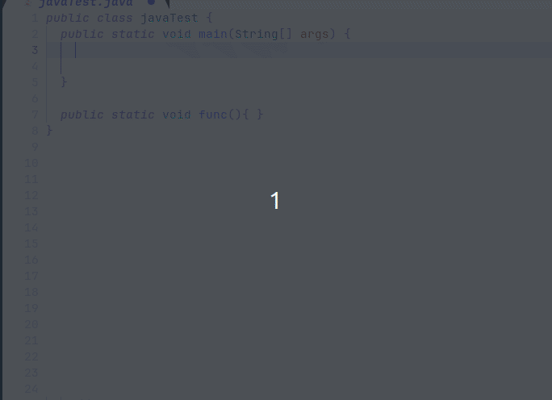

# TreeSetter
Never type an equals `=` or a semicolon `;` again! 

TreeSetter is an [nvim-treesitter-module](https://github.com/nvim-treesitter/module-template) which automatically adds an equals sign (`=`) and semicolons (`;`) at the appropriate place whenever you hit enter (for `;`) or the space bar (for `=`). This will help you to not look at your keyboard and type faster. The insertion of commas (`,`) and double points (`:`) is under development.

This plugin is a fork of TornaxO7/tree-setter, but the original repo is incomplete and has been archived.

**Note:** The plugin should work well most of the time, however since it's still very young, it is very possible that it has some bugs. 

**Languages:**
It supports **Python, JavaScript, Java, and C**, for now.

# How it works
Simply press on the space bar to insert an equals sign (`=`) at the appropriate place e.g. after a variable declaration `int x = 1;` or `x = 1`. For Java and C, press enter at the end of the line to insert a semicolon (`;`). 


# Installation
**Vim-plug:**
``` bash
Plug 'filNaj/tree-setter'
```

**Packer:**
``` bash
use 'filNaj/tree-setter'
```

Add `tree_setter` (and not `tree_sitter` !) into your `treesitter` settings:

```lua
require('nvim-treesitter.configs').setup {
    -- your other modules ...

    tree_setter = {
        enable = true
    },

    -- your other modules ...
}
```

# Contributing
Take a look into the [CONTRIBUTING.md](https://github.com/filNaj/tree-setter/blob/master/CONTRIBUTING.md) file for that ;)
Credit to TornaxO7.

### TODO
- [ ] Add colon `:` automatically, e.g. for switch cases.
- [ ] Add commas `,` automatically, e.g. for lists or dictionaries.
